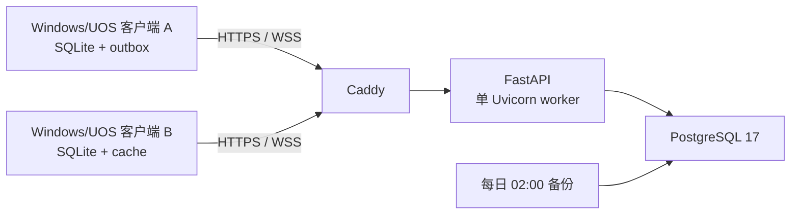

# 逃费车辆信息智能查询平台

逃费车辆信息智能查询平台（内部项目代号 `IntDemo`）是一个面向运输业务处理场景的 PyQt5 桌面客户端，支持 Windows x64 和统信 UOS 20 ARM64。项目将“运输证查询回填”和“爱企查批量查询”整合为一条可暂停、继续和停止的处理流水线，完成运输证号查询、营运企业回填以及企业法人、地址、电话补齐。

当前版本：`1.0.4`。`v0.1` 的本地数据库和发布包保持不变，
`v0.2` 使用独立应用名称及独立数据目录，不迁移测试数据。

## v0.2 在线架构

桌面客户端仍在本机完成三步业务并以 SQLite 离线优先运行，服务器只接收
账号权限、指标数量、违规原因汇总、批次/运行状态、用时和不可逆输入指纹，
以及管理员主动发布的公告正文/附件和普通用户主动发送的文字消息。原始 Excel、
逐行车辆信息、文件路径、运行日志和浏览器 Cookie 永不上传。

另有一条与业务同步隔离的授权验证码学习通道，管理员可选择“关闭”“仅统计”
或“采集样本并统计”。默认关闭；“仅统计”不上传图片和答案，只用于计算线上
成功率；第三档才会在成功后上传验证码图片及数字答案或文字点选坐标。详见
[验证码机器学习](docs/CAPTCHA_LEARNING.md)。



- 普通账号首次登录必须联网；成功后若服务器临时不可达，可凭账号密码和
  Ed25519 离线授权连续离线使用 7 天，期间产生的数据会保留并在恢复连接后同步。
- 登录页的“离线登录”无需账号或密码，只开放一键业务处理；游客
  本次不记录统计、流程计时或待同步数据，也不能查看数据中心和账号功能。
- 有待发送数据时每 5 秒尝试上传，WebSocket 通知后增量拉取，30 秒轮询兜底。
- 访问/刷新令牌和离线资料在 Windows 上由 DPAPI 加密，在 Linux 上由当前用户
  Secret Service 保存主密钥并以 AES-GCM 加密；只有勾选“记住密码”时才保存
  登录密码密文。
- Windows 在线测试数据库位于 `%LOCALAPPDATA%\IntDemoClientOnlineTest\client-v2.db`；
  UOS 位于 `~/.local/share/intdemo-client-online-test/client-v2.db`。
- 服务端、部署与迁移说明见 [部署手册](docs/DEPLOYMENT.md)、
  [同步协议](docs/SYNC_PROTOCOL.md)、[验证码机器学习](docs/CAPTCHA_LEARNING.md)、
  [恢复演练](docs/RESTORE_DRILL.md) 和 [迁移手册](docs/MIGRATION.md)。

## 客户端业务能力

项目主要提供以下能力：

- 使用统一登录入口和主界面管理运输业务处理流程。
- 登录页支持记住密码和自动登录；等待登录、改密及在线管理请求时会显示
  模态加载状态，避免误以为程序无响应。
- 无账号密码时可选择“离线登录”，只处理并保存用户主动选择的业务
  表格，不读取账号数据，也不写入统计、计时和同步队列。
- “系统设置”集中展示账号资料、版本信息、更新内容、检查按钮和下载进度；
  新版本会通过弹窗及侧边栏红点提示。更新提示等待处理时只锁定业务内容，
  最小化、最大化和关闭按钮始终可用；普通更新可选择稍后更新、后台更新或
  立即更新，下载在后台进行，开始安装时才暂停其他业务。
  Windows x64 与 UOS ARM64 共用同一更新通道；服务端按平台分别下发 `.exe`
  或 `.deb`，下载后均校验大小和 SHA-256，再调用对应系统安装器。
- 窗口顶部提供公告喇叭和 7 秒轮播入口；管理员可发布富文本公告、上传图片或
  文件、选择开屏展示及指定普通用户，普通用户可在公告详情中发送纯文字消息，
  管理员在“公告发布”页面集中查看并标记已读。
- 侧边栏同步按钮直接展示待同步数量，可一键立即同步。
- 登录页、主内容区、数据控件、弹窗和分层侧边栏统一使用深青绿、薄荷绿与暖橙色主题；当前账号集中展示在侧边栏身份卡中。
- 支持管理员和普通用户两种角色；在线账号由服务器统一创建和编辑，可设置数据范围和登录设备上限（默认 10000 台），达到上限后需先撤销旧设备或提高数量，同时支持密码重置、启停、归档/恢复和异常设备撤销。归档保留历史统计，统计重置是独立且受审计的操作。
- 仪表盘继续从本地 SQLite 缓存按站点和日期范围查询、展示及导出汇总数据，断网时仍可查看最近一次同步结果。
- 对同一份 `.xlsx` 文件依次执行运输证查询、营运企业回填和爱企查信息补齐。
- 业务表格区域支持“导入腾讯文档”：每个程序登录账号分别记住上次链接及
  腾讯文档浏览器登录状态。可公开查看的表格会在后台匿名加载和读取，不要求
  网页保持前台；只有文档确实要求登录时才打开可见浏览器。程序优先使用结构化
  HTML 剪贴板还原多行单元格，再定位“公司名称”（兼容“企业名称”
  “车辆所有人/企业”）列最后一个非空行，并把其后的全部行写入新 Excel 后
  自动导入。该准备过程发生在流水线计时启动前，不计入业务用时。
- 三步结果均使用 `openpyxl` 定向回写目标单元格，并通过同目录临时文件原子替换保存，避免中途停止时重建整表或丢失下方数据；“已协助补缴”后的带格式空列会优先复用，旧版追加到右侧的结果列会在再次写入时自动迁回。
- 重新执行流程时，已有运输证号、已有车辆所有人/企业信息或已协助补缴的记录会跳过运输证查询，避免重复访问网站。
- 持久化记录每次流水线和各步骤的有效用时、暂停时间及重试次数；手动停止后再次处理相同输入数据时，会接续原批次累计用时且不重复计算暂停间隔。
- 业务处理页使用高精度时钟并以约 60 帧/秒平滑刷新毫秒计时；运行期间仍独立定期保存计时心跳，程序异常退出后会保留最后一次心跳前的累计时间，并在下次启动时将旧运行标记为异常中断。
- 数据仪表盘只统计三个步骤全部成功的批次，按站点和完成日期范围展示总用时、有效用时、基于总用时计算的整数每小时处理量和效率提升比例；批次完成后会纳入此前停止、异常或重试产生的用时，精简悬停卡片可查看每条平均秒数和毫秒级精确平均等必要明细，升级前无计时记录的历史条数不参与平均值计算。
- 将运行参数集中在独立标签页，并可实际启动自动适配的 Chromium 执行健康检查。
- 实时展示数据预览、总体进度、分步骤状态和运行日志。
- 数据预览和流水线日志可分别收起或展开，按当前工作重点调整页面空间。
- 流水线日志跨多次执行保留最近 5000 行，并用执行次数分隔；任一步骤的业务浏览器被手动关闭、目标页返回 HTTP 错误或导航超时时，会持续重启已适配的 Chromium 并重试当前记录，不限制恢复次数，直至恢复成功或用户主动停止；爱企查在等待人工登录和“继续执行”期间也会持续监测浏览器，关闭后自动重新打开并再次提示登录，点击停止则会主动中断仍在等待的页面加载并关闭当前会话。
- 退出时若浏览器线程长期未结束，可选择“继续等待”或“保存并强制退出”；强制退出会先原子保存全部已完成记录并结算计时，再终止卡住的线程。若表格或计时状态保存失败，程序会保留原文件并拒绝强制退出。
- 三步业务查询的页面等待上限为 2 分钟；验证码题目和图片完全加载并保持稳定后才开始自动或人工处理，验证码通过后也会继续等待企业结果真正返回；纯技术超时会触发恢复或记录失败，不会误弹公司人工录入框。
- 全局禁用控件统一使用禁止指针和低对比度淡化样式，重新启用后自动恢复正常外观。
- 支持数字验证码、中文点选验证码、网站登录和必要的人工录入。
- 管理员侧边栏提供“机器学习”页面：可随时切换三档客户端上报策略，实时查看样本
  数量/占用空间、当前模型线上成功率和候选模型固定留出集准确率，导入/导出
  ZIP 数据集，并分别训练、应用或删除数字与文字点选候选模型。
- 提供按站点、日期范围、完成类型和违规原因筛选的数据仪表盘，开始与结束日期均包含当天。
- 管理员可在完成类型中查看“空”异常数据总数，并按用户（站）追溯异常条数、本站总数和占比；普通用户不显示异常入口。
- 仪表盘环形分区和完成类型、违规原因计量条支持悬停查看数量、占比或电话拆分详情；各站分布同时提供总计数、有电话数、总耗时和有效耗时四个圆环图。
- 将账号镜像、统计缓存、本机业务记录和待同步队列保存在本地 SQLite；服务端密码使用 Argon2id，Windows 客户端使用 DPAPI，Linux 客户端使用 Secret Service + AES-GCM 保存加密资料及 PBKDF2 离线验证器。
- 提供离线自动化测试，并支持使用 PyInstaller 构建 Windows x64 与 UOS ARM64 客户端。

> 查询网站的验证码、页面结构和访问策略可能变化。涉及真实网站的功能需要使用合法账号、授权数据和当前网络环境进行验收。

## 环境要求

- Windows 10/11 x64，或 UOS Desktop 20 Professional ARM64
- Windows 使用 64 位 Python 3.9；UOS 使用隔离的 Miniforge Python 3.10，不修改系统 Python 3.7
- 网络连接（Windows 与 UOS 构建均携带项目内置 Chromium）
- Git（仅克隆和参与开发时需要）

## 安装方法

### 1. 获取代码

```powershell
git clone https://github.com/e23Aqiu/intdemo.git
cd intdemo
```

仓库当前为私有仓库，克隆账号需要拥有访问权限。

UOS ARM64 请直接使用兼容分支，并按专项文档操作：

```bash
git clone --branch codex/uos-arm64-compat --single-branch \
  https://github.com/e23Aqiu/intdemo.git
cd intdemo
bash scripts/uos-arm64/prepare-env.sh
```

环境准备脚本会把与固定 Playwright 版本匹配的 ARM64 Chromium 下载到项目缓存，
构建产物会自动携带该浏览器，不要求最终用户安装系统浏览器。
UOS 成品包还会预置在线测试服务 `https://43.138.177.65` 及其公开 Caddy 根证书；
已有的 `~/.config/intdemo-client/client-online.json` 始终优先且不会在升级时被覆盖。

完整说明见 [`docs/UOS_ARM64.md`](docs/UOS_ARM64.md)。下面的虚拟环境与依赖
安装命令仅适用于 Windows。

### 2. 创建并激活虚拟环境

```powershell
py -3.9 -m venv .venv
.\.venv\Scripts\Activate.ps1
```

如果 PowerShell 阻止激活脚本，可在当前终端临时允许本地脚本：

```powershell
Set-ExecutionPolicy -Scope Process -ExecutionPolicy Bypass
.\.venv\Scripts\Activate.ps1
```

### 3. 安装依赖

```powershell
python -m pip install --upgrade pip
python -m pip install -r requirements.txt
$env:PLAYWRIGHT_BROWSERS_PATH='0'
python -m playwright install chromium
Remove-Item Env:PLAYWRIGHT_BROWSERS_PATH
```

最后三条命令会将业务处理统一使用的 Chromium 安装到项目虚拟环境中；无需选择或依赖系统浏览器。

如需构建安装包，再安装开发依赖：

```powershell
python -m pip install -r requirements-dev.txt
```

## 运行方法

在已激活虚拟环境的终端中执行：

```powershell
@'
{
  "base_url": "https://api.example.com",
  "ca_bundle": null,
  "channel": "test"
}
'@ | Set-Content .\client-online.json -Encoding UTF8
python main.py
```

公网 IP 测试必须把 `ca_bundle` 改为随包 Caddy 根证书路径；客户端拒绝
`http://`、缺少私有 CA 的 IP 地址以及 `verify=False` 式绕过。

也可以在资源管理器中双击 `run.bat`。该脚本会优先使用项目目录内的 `.venv`。

### v0.2 首次登录

- 管理员账号：`admin`
- 初始密码：`123456`

首次登录后系统会要求修改初始密码。正式使用前应创建个人管理员账号，并妥善保管密码。

服务器还会幂等创建并启用以下普通站点账号；所有初始账号首次登录均必须
修改密码：

| 用户名称 | 登录账号 | 初始密码 |
| --- | --- | --- |
| 萝岗中心站 | `luogang` | `123456` |
| 太平中心站 | `taiping` | `123456` |
| 道滘中心站 | `daojiao` | `123456` |
| 宝安中心站 | `baoan` | `123456` |
| 南头中心站 | `nantou` | `123456` |

### 本地数据

v0.2 Windows 默认数据目录为：

```text
%LOCALAPPDATA%\IntDemoClientOnlineTest\client-v2.db
```

可通过环境变量 `INTDEMO_DATA_DIR` 指定其他数据目录。数据库保存离线缓存、
待同步队列、隔离项和本机业务计时；Windows 令牌及离线资料以 DPAPI 密文保存，不保存
明文密码。v0.1 原目录 `%LOCALAPPDATA%\IntDemoClient\client.db` 不会被读取
或覆盖。腾讯文档链接保存在同目录的 `preferences.json`，登录 Cookie 位于
按程序账号隔离的 `browser-profiles\tencent-docs`，二者都不会同步到服务器；
自动生成的新表位于 `imports\tencent-docs`。

UOS 默认数据目录为：

```text
~/.local/share/intdemo-client-online-test/
```

UOS 在线资料使用桌面 Secret Service 保存主密钥，并以 AES-GCM 密文落库；
可通过相同的 `INTDEMO_DATA_DIR` 环境变量覆盖数据目录。

## 测试与构建

运行 Windows 客户端测试（包含离线回归、在线安全和腾讯文档导入规则测试）：

```powershell
$env:QT_QPA_PLATFORM='offscreen'
python -m unittest discover -s tests -v
```

服务端测试：

```powershell
cd server
python -m pip install -e ".[test]"
python -m pytest
```

完整 Compose 验收由 GitHub Actions 执行真实 PostgreSQL、两台逻辑客户端、
WebSocket、私有 CA、备份和全新数据库恢复。真实运输证、营运查询及爱企查
流程仍需在授权环境人工验收。

UOS ARM64 真机构建与测试（默认同时生成便携包和原生 DEB）：

```bash
bash scripts/uos-arm64/diagnose.sh
bash scripts/uos-arm64/build.sh
```

产物位于 `dist/uos-arm64/IntDemo-UOS-arm64-<版本>.tar.gz` 和同名 `.deb`。
两者均包含已在目标 UOS 20 真机验证的 ARM64 Chromium，以及与 conda-forge Qt
匹配的 ARM64 GNU C++ 运行库、在线测试服务配置和公开根证书。DEB 按 UOS 规范
安装到 `/opt/apps/com.e23aqiu.intdemo/`，用户数据库与配置仍位于 XDG 用户目录，
升级或卸载程序不会删除业务数据；DEB 桌面 ID 与包 AppID 保持一致，切换前需先
卸载历史用户级入口。构建会验证 Qt 所需的 GLIBCXX ABI、在线配置及成品运行库。
详细的系统依赖、浏览器覆盖、XWayland 策略与验收清单见
[`docs/UOS_ARM64.md`](docs/UOS_ARM64.md)。

同时构建 Windows 免安装便携包和安装包（公网 IP 测试方案）：

```powershell
winget install --id JRSoftware.InnoSetup --exact
.\scripts\build-releases.ps1 `
  -BaseUrl https://203.0.113.10 `
  -CaBundle .\intdemo-caddy-root.crt `
  -Version 0.2.5 `
  -DeltaFromVersion 0.2.4
```

构建结果同时生成：

- `dist\portable\IntDemoOnline-Portable-0.2.5.zip`：完整解压后直接运行，
  不写注册表、不创建快捷方式，适合临时测试和压缩包分发。
- `dist\installer\IntDemoOnline-Setup-0.2.5.exe`：按当前用户安装到
`%LOCALAPPDATA%\Programs\IntDemoOnline`，提供开始菜单、可选桌面快捷方式
和标准卸载入口；本地数据库仍留在独立的数据目录，升级或卸载程序不会删除
业务缓存。

当前测试包由 Inno Setup 6.7.3 构建。公司正式商用发布前需购买对应商业
许可证，或改用公司已有授权的安装工具。

准备并发布后续更新：

```powershell
.\scripts\publish-update.ps1 `
  -WindowsInstaller .\dist\installer\IntDemoOnline-Setup-0.2.5.exe `
  -UosInstaller .\dist\uos-arm64\IntDemo-UOS-arm64-0.2.5.deb `
  -DeltaInstaller .\dist\installer\IntDemoOnline-Patch-0.2.4-to-0.2.5.exe `
  -DeltaFromVersion 0.2.4 `
  -Version 0.2.5 `
  -Notes "本次更新说明" `
  -RemoteHost intdemo-test `
  -RemotePath /opt/intdemo/deploy/updates
```

发布脚本在同一个 `test.json` 的 `platforms` 中原子写入 Windows x64 和 UOS
ARM64 完整包；同时把 Windows 完整包保留在顶层以兼容旧客户端，并把可选 Windows
差异包写入 `deltas.from_version`。更新清单接口读取客户端平台与当前版本：只有
Windows 当前版本精确匹配差异包来源版本时才返回增量包，其他情况返回对应平台
完整包。
客户端后台检查同一 HTTPS 服务器的 `/updates/test.json`，下载后同时核对文件大小与 SHA-256，
不会绕过私有 CA。版本号、更新内容、检查按钮和下载进度统一位于“系统设置”；
检测到新版本时会弹窗提示，侧边栏显示新版本标记。安装版和便携版都可以
下载并启动新安装包进行升级。下载可随时停止并显示实时速度，下载期间业务页
保持可用；只有开始安装时才要求保存并停止当前业务。

旧版客户端虽然不识别 `deltas`，但会在 `User-Agent` 中携带当前程序版本；
服务器会为它生成兼容的顶层字段。例如 0.2.4 获取 0.2.4→0.2.5 增量包，
0.2.3 及更早版本获取完整 0.2.5 安装包。新版客户端还会额外发送
`X-IntDemo-Version` 和 `X-IntDemo-Platform`，并在本机再次校验平台、包扩展名与
`from_version`。

### 开发者专用打包发布器

推荐在 UOS ARM64 真机启动独立 GUI 发布器：

```bash
bash scripts/uos-arm64/run-release-publisher.sh
```

发布器可单选或全选构建 Windows EXE 与 UOS DEB，并可在“输出类型”中单独选择
安装包、标准结果 ZIP 或两者。仅安装包模式只生成可直接安装的 EXE/DEB；仅构建包
模式生成可由另一台打包器导入的结果 ZIP（结果包内部仍含用于校验的安装包）。
DEB 必须在 UOS ARM64
真机生成；EXE 可在 Windows 本机生成，也可交给 GitHub Actions。GitHub 不可用时
会保留可验证任务 ZIP，供个人或站点 Windows x64 真机完成。Windows 构建只把服务
地址和公开 CA 写入安装包，不访问 IntDemo 程序服务器，因此 Windows 所在网络即使
无法进入公司 `121.x` 网段也能构建。UOS 打包与 SSH 发布本身不需要 Docker。

Windows 开发机可双击 `run-release-publisher.bat` 作为双端主控。Windows 和 UOS
都能点击“导入 Windows 构建包”或“导入统信构建包”，取得同版本、同提交和同在线
配置的两端校验收据后执行完全相同的双端发布。两种主控都支持版本字段同步、环境
检查、双端发布确认、SSH 上传、发布快照归档、客户端断连测试和暂停远程更新通道；
构建与发布权限不会进入业务客户端。

发布器可填写 Gitee 仓库链接，“推送 GitHub + Gitee”会依次使用普通 `git push`
同步 `origin`（GitHub）和 `gitee` 两个远程，不会强制推送；版本区还会提醒 EXE、
DEB 的待发布状态。正式发布要求同版本、同提交、同在线配置的双端校验收据，
已保存发布快照的版本不能原地覆盖；Windows 增量必须使用真实已发布快照，不能
重建旧提交代替。暂停期间新的客户端检查按“暂无更新”处理，发布更高版本后自动
恢复分发。完整说明见
[`docs/UOS_RELEASE_CONTROL.md`](docs/UOS_RELEASE_CONTROL.md) 和
[`docs/RELEASE_PUBLISHER.md`](docs/RELEASE_PUBLISHER.md)。

## 项目目录结构

```text
intdemo/
├── main.py                         # 应用入口
├── run.bat                         # Windows 快速启动脚本
├── run-release-publisher.bat       # 开发者专用打包发布器
├── release_publisher/              # 本地测试、构建与发布 GUI
├── requirements.txt                # 运行依赖
├── requirements-dev.txt            # 构建与开发依赖
├── requirements-uos-arm64.txt      # UOS ARM64 pip 运行依赖
├── environment-uos-arm64.yml       # UOS ARM64 conda/PyQt5 构建环境
├── integrated_client.spec          # PyInstaller 构建配置
├── integrated_client_uos_arm64.spec # UOS ARM64 PyInstaller 构建配置
├── packaging/uos-arm64/            # UOS 启动器、桌面入口与用户安装脚本
├── installer/                       # Inno Setup 安装包定义和版本资源
├── integrated_client/
│   ├── app_controller.py           # 应用生命周期与窗口协调
│   ├── config.py                   # 应用常量与数据目录配置
│   ├── database.py                 # 账号、权限与统计数据持久化
│   ├── models.py                   # 领域数据模型
│   ├── security.py                 # 密码哈希与校验
│   ├── online/                     # 在线认证、DPAPI/Secret Service、同步与 WebSocket
│   ├── platform_support.py         # UOS/ARM64、Qt 与 Chromium 平台适配
│   ├── timing.py                   # 流水线批次、运行和步骤计时
│   ├── tools/
│   │   ├── transport_tool.py       # 运输证查询与营运信息回填
│   │   └── aiqicha_tool.py         # 爱企查企业信息补齐
│   └── ui/
│       ├── account_page.py         # 账号管理页面
│       ├── auth_dialogs.py         # 登录与密码对话框
│       ├── main_window.py          # 主窗口
│       ├── statistics_page.py      # 数据仪表盘
│       ├── theme.py                # 全局界面主题
│       └── workflow_page.py        # 一体化业务流水线页面
├── server/                          # FastAPI、SQLAlchemy 与 Alembic
├── deploy/                          # Caddy、备份、恢复及 Ubuntu 脚本
├── scripts/uos-arm64/               # UOS 环境、诊断、预检与构建脚本
├── docker-compose.yml               # api/postgres/caddy/backup
├── tests/                           # 客户端离线与在线自动化测试
├── DEVELOPMENT_LOG.md              # 历史开发记录
└── README.md                        # 项目说明
```

## v0.2 明确不包含

本测试版不建设 Web 管理后台、文件云盘、静默强制更新、Redis、多 API
实例或多节点高可用。目标规模为 20 个以内 Windows/UOS 终端。

## 维护说明

- 不要提交真实业务表格、运行数据库、日志、Cookie、访问令牌或网站账号信息。
- 修改业务工具后应同时运行离线测试，并对相关真实网站流程进行授权环境下的人工验收。
- 详细的历史实现记录见 `DEVELOPMENT_LOG.md`。
