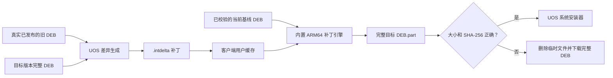

# 统信 UOS ARM64 应用内增量更新设计

## 1. 文档状态

- 状态：v1.2.1 代码实现完成；客户端、服务端能力协商、补丁脚本与发布器协议
  已实现，尚待 UOS ARM64 真机构建与灰度，正式清单未启用 UOS 增量包。
- 目标平台：统信 UOS Desktop 20 Professional ARM64（`linux-aarch64`）。
- 过渡版本：v1.2.1。v1.2.0 及更早客户端不具备补丁处理能力，因此升级到
  v1.2.1 时仍使用完整 DEB；由旧版应用内完整更新并保留的 v1.2.1 DEB 可在后续
  版本作为基线。
- 首个候选增量目标为 v1.2.2，但只有真实补丁低于完整 DEB 的 50% 且 ARM64
  真机测试通过时才允许发布，否则继续使用完整 DEB。

## 2. 现状与问题

当前 UOS 更新链路为：

1. 客户端按 `linux-aarch64` 请求更新清单。
2. 服务器返回目标版本完整 `.deb`。
3. 客户端下载完整 DEB，核对大小和 SHA-256。
4. 客户端关闭业务后调用 `deepin-deb-installer`、`xdg-open` 或
   `pkexec dpkg --install` 安装。

现有 UOS DEB 约为 327 MB，包含 PyInstaller 应用、Python/Qt 运行库和
内置 Chromium。大多数业务发布只改变少量客户端代码，却需要重新下载
整个 DEB。

现有架构已具备部分通用能力：

- 更新清单支持按平台选择安装包。
- 客户端和服务器都能根据 `from_version` 匹配 `deltas`。
- 客户端已具备 HTTPS、大小/SHA-256 校验和完整包安装流程。
- 发布器已实现 Windows 增量来源快照、产物收据和原子发布。

当前缺失的是 UOS 增量产物、基线 DEB 管理、ARM64 补丁引擎、目标
DEB 重建以及完整的发布/回退测试。

## 3. 已确定的产品约束

1. 用户不需要安装 `xdelta3`、Python 包或其他应用外插件。
2. ARM64 补丁引擎随客户端完整 DEB 内置。
3. 应用内完成更新检查、增量下载、目标 DEB 重建和校验。
4. 安装阶段仍需关闭程序，并由 UOS 系统安装器获取管理员授权。
5. 不直接覆盖 `/opt/apps/com.e23aqiu.intdemo`，不绕过 `dpkg` 的完整包
   管理。
6. 任何增量条件不满足或失败时，都必须自动回退完整 DEB。
7. 基线 DEB 只保存在用户数据缓存中，不放入程序安装目录。
8. 只保留当前已确认安装版本的一份基线 DEB。
9. 用户可以清理缓存；基线被删除不影响程序运行，下次自动使用完整更新。
10. 旧客户端、跳版客户端和未声明增量能力的客户端只能收到完整 DEB。
11. 增量更新改造不得影响 v1.1.0、v1.1.1 客户端的正常使用，也不得使
    这些版本中已登录的账号退出登录、会话失效、丢失本地数据或中断正常同步。
    任何一项兼容性回归都视为阻断发布的问题。

## 4. 方案选择

### 4.1 采用方案

采用“完整 DEB 二进制差异 + 客户端重建目标 DEB”：



首选差异算法为 `xdelta3`，原因是可流式应用、额外内存可控，并适合
数百 MB 文件。协议必须声明算法和格式版本，不把客户端永久绑定到
单一实现。

### 4.2 不采用的方案

- **只包含变化文件的部分 DEB**：`dpkg` 升级时可能将新包中未出现的旧文件
  当成已删除内容，不能作为安全的增量包。
- **直接覆盖已安装目录**：会破坏 `dpkg` 文件记录、回退和卸载语义。
- **常驻 root 更新服务**：引入新的特权进程、启动项和安全维护成本，不符合
  当前规模。
- **依赖用户预装 `xdelta3`**：UOS 终端环境不一致，不满足“无额外插件”要求。

## 5. 发布前必须完成的效果基准

DEB 中的 `data.tar.xz` 为整体压缩流，少量文件变化也可能导致较大的
二进制差异。因此在进入完整开发前，先使用真实已发布产物进行基准测试：

- 1.1.0 → 1.1.1。
- 1.1.1 → 当前 UOS 最新完整构建。
- 一个只修改 Python 业务代码的受控构建对。
- 一个同时更新 Chromium 或 PyInstaller 依赖的构建对。

首版接受门槛：

- 补丁大小小于目标完整 DEB 的 50%；否则该来源版本不发布增量包。
- 在目标 UOS ARM64 真机上重建时间不超过 180 秒。
- 补丁进程额外峰值内存建议不超过 256 MiB。
- 重建结果必须与正式完整 DEB 逐字节一致，SHA-256 必须相同。

如果连续业务版本的补丁仍经常超过 50%，则停止完整 DEB 二进制差异
路线，改为将内置 Chromium/稳定运行库与业务程序拆分为独立软件包。

## 6. 增量清单协议

继续使用现有 schema v1 的可选扩展字段，不强制旧客户端理解新格式。
UOS 平台示例：

```json
{
  "platforms": {
    "linux-aarch64": {
      "full": {
        "installer_path": "/updates/files/IntDemo-UOS-arm64-1.2.2.deb",
        "sha256": "<target-deb-sha256>",
        "size": 327000000
      },
      "deltas": [
        {
          "format": "uos-deb-xdelta-v1",
          "algorithm": "xdelta3",
          "from_version": "1.2.1",
          "base_sha256": "<released-1.2.1-deb-sha256>",
          "base_size": 327000000,
          "installer_path": "/updates/files/IntDemo-UOS-arm64-Patch-1.2.1-to-1.2.2.intdelta",
          "sha256": "<patch-sha256>",
          "size": 24000000,
          "target_sha256": "<target-deb-sha256>",
          "target_size": 327000000
        }
      ]
    }
  }
}
```

字段规则：

- `from_version` 必须精确等于客户端当前版本。
- `format` 必须为客户端声明支持的格式。
- `base_sha256` 和 `base_size` 校验客户端缓存的旧完整 DEB。
- `sha256` 和 `size` 校验下载的补丁。
- `target_sha256` 和 `target_size` 必须与同平台 `full` 完全一致。
- 增量包和完整包必须来自相同 HTTPS 服务和信任链。

新客户端增加能力头：

```text
X-IntDemo-Update-Capabilities: uos-deb-xdelta-v1
```

服务器只对同时满足以下条件的 UOS 客户端选择增量包：

1. `X-IntDemo-Platform` 为 `linux-aarch64`。
2. 能力头包含目标 `format`。
3. 当前版本精确匹配 `from_version`。

没有能力头的 v1.1.0/v1.1.1 及其他旧客户端必须继续获得完整 DEB。
Windows 现有增量选择规则不受影响。

## 7. 客户端基线缓存

建议目录：

```text
<get_data_dir()>/updates/
├── base/
│   ├── IntDemo-UOS-arm64-1.2.1.deb
│   └── metadata.json
├── pending/
│   ├── IntDemo-UOS-arm64-1.2.2.deb.part
│   └── pending-install.json
└── patches/
    └── IntDemo-UOS-arm64-Patch-1.2.1-to-1.2.2.intdelta
```

`metadata.json` 至少包含：

```json
{
  "schema_version": 1,
  "platform": "linux-aarch64",
  "version": "1.2.1",
  "file": "IntDemo-UOS-arm64-1.2.1.deb",
  "size": 327000000,
  "sha256": "<released-full-deb-sha256>",
  "installed_confirmed_at": "<UTC timestamp>"
}
```

缓存生命周期：

1. 第一次手工安装客户端时，不假设系统安装器会保留来源 DEB。
2. 增量能力启用后的第一次应用内更新使用完整 DEB，并保留下载文件。
3. 启动目标版本时，只有 `APP_VERSION` 与 `pending-install.json` 一致且
   DEB 校验通过，才将它提升为新基线。
4. 新基线确认后才删除旧基线。
5. 常态只保留一个基线 DEB；安装待确认期可短暂同时保留旧、新两个。
6. 缓存目录使用用户权限，建议目录权限 `0700`、文件权限 `0600`。
7. 基线不存在、大小不符或 SHA-256 不符时，不尝试修复或猜测，直接使用完整包。

用户可以删除该缓存，删除后只失去下一次增量资格，不影响已安装应用、
本地数据库、在线配置、浏览器资料或已登录账号。

## 8. 客户端更新状态机

```text
checking
  → delta_available | full_available
  → downloading_delta
  → verifying_delta
  → reconstructing_deb
  → verifying_target
  → ready_to_install
  → installing
  → pending_confirmation
  → confirmed
```

以下任一状态进入 `fallback_full`：

- 基线不存在或 `base_sha256` 不匹配。
- 补丁格式或算法不支持。
- 补丁下载失败或 SHA-256 不匹配。
- 补丁引擎启动失败、超时、被取消或非零退出。
- 重建目标大小或 SHA-256 不匹配。
- 临时目录可用空间不足。

回退完整包属于正常更新路径，不应显示为不可恢复故障。强制更新同样先
尝试增量，失败则下载完整 DEB。

## 9. 重建与安全要求

1. 补丁引擎以当前桌面用户身份运行，不使用 root 重建文件。
2. 引擎位于应用自有目录，构建时验证 AArch64 ELF、glibc 2.28 基线、文件
   SHA-256 和许可证文件。
3. 使用绝对路径参数启动引擎，不经过 Shell，不接受服务器提供的任意命令行。
4. 输出先写入 `.part`，校验通过后在同一文件系统上原子改名。
5. 重建前检查可用空间至少为 `target_size + patch_size + 128 MiB`。
6. 使用跨进程锁防止同一 OS 用户同时启动多个更新任务。
7. 中断、取消、超时或崩溃后删除不可信的 `.part`，保留当前已确认基线。
8. 只在重建后完整 DEB 同时通过大小和 SHA-256 校验时调用系统安装器。
9. 安装仍复用当前 `update_install_command()`，不新增常驻特权组件。
10. 补丁、基线和目标 DEB 均不得包含或修改用户数据目录。

当前 HTTPS 私有 CA 和 SHA-256 保持传输完整性。商用强化可另行增加离线签名
清单，但不作为首版 UOS 增量更新的前置条件。

## 10. UOS 补丁生成与发布

新增 `scripts/uos-arm64/build-delta.sh`，输入：

- 真实已发布的来源版本完整 DEB。
- 当前构建的目标版本完整 DEB。
- 来源版本发布收据/快照。

生成脚本必须：

1. 检查两个 DEB 的 `Package=com.e23aqiu.intdemo`。
2. 检查两个 DEB 的 `Architecture=arm64`。
3. 检查来源、目标版本精确匹配，且来源低于目标。
4. 使用来源版本正式收据校验旧 DEB，禁止重建旧提交代替真实产物。
5. 生成 `.intdelta`。
6. 立即使用同一引擎重建目标 DEB，校验大小和 SHA-256。
7. 根据 50% 阈值决定是否将增量产物写入构建收据。
8. 输出补丁大小、完整包大小、节省比例、生成时间和重建时间。

发布系统新增 UOS 小型快照，保存：

- 版本、平台和源 Git 提交。
- 正式完整 DEB 的文件名、大小和 SHA-256。
- 发布时间和远程路径。

快照本身不包含 327 MB DEB。生成下一版补丁时，从发布主控本地产物库
或远程更新服务器取得真实旧 DEB，并使用快照 SHA-256 验证。

首版只支持每个目标版本的一个 UOS 来源版本。跳过多个版本的客户端使用
完整 DEB，不在客户端串联多个补丁。

## 11. 代码改动清单

| 区域 | 预计文件 | 实施内容 |
|---|---|---|
| 客户端清单 | `integrated_client/online/update.py` | 保留 full/delta 双产物信息，校验 UOS 补丁字段和后缀，增加能力头和完整包回退 |
| UOS 增量核心 | 新增 `integrated_client/online/uos_delta.py` | 基线缓存、空间检查、补丁应用、目标校验、pending/base 转换和清理 |
| 后台任务 | `integrated_client/online/update_coordinator.py` | 增加补丁校验、重建、目标校验和 fallback 状态，保持 UI 线程不阻塞 |
| 安装入口 | `integrated_client/ui/main_window.py` | 区分增量下载与重建状态，重建成功后继续复用完整 DEB 安装 |
| 平台支持 | `integrated_client/platform_support.py` | 定位内置 ARM64 补丁引擎；现有 DEB 安装命令保持不变 |
| UOS 打包 | `integrated_client_uos_arm64.spec`、`scripts/uos-arm64/build.sh` | 打入补丁引擎和许可证，验证 AArch64/glibc/哈希 |
| 补丁构建 | 新增 `scripts/uos-arm64/build-delta.sh` | 核对真实旧 DEB，生成、回放验证补丁并执行收益阈值 |
| 发布器核心 | `release_publisher/core.py`、`release_publisher/release_tasks.py` | UOS 增量来源、快照、收据、标准结果 ZIP、清单和远程原子发布 |
| 发布器界面 | `release_publisher/ui.py` | 单独显示 UOS 增量来源、生成状态、体积节省率和完整包回退状态 |
| 发布服务 | `server/app/update_manifest.py` | 识别客户端增量能力，仅向兼容 UOS 客户端选择 `.intdelta` |
| 部署清单 | `scripts/publish-update.ps1` 及发布文档 | 可选上传 UOS 增量产物，完整 DEB 仍为必选 |

为避免当前只有一个 `delta_from_version` 同时绑定两个平台，发布选项建议
保留已有 Windows `delta_from_version`，另行增加 `uos_delta_from_version`。

## 12. 客户端完整处理流程

1. `UpdateClient.check()` 解析 UOS `full` 和所有 `deltas`。
2. 根据 `APP_VERSION`、能力格式和 `from_version` 寻找精确补丁。
3. 根据基线元数据和实际文件校验 `base_sha256`。
4. 基线可用时选择补丁；否则选择 `full`。
5. 下载选定产物。补丁下载不改变当前程序文件。
6. 补丁下载成功后再次校验基线，防止下载期间被清理或修改。
7. 获取跨进程更新锁，进行空间检查。
8. 在 `pending` 目录调用内置补丁引擎重建 `.deb.part`。
9. 校验 `target_size` 和 `target_sha256`。
10. 原子改名为完整目标 DEB，写入 `pending-install.json`。
11. 用户选择安装时，按当前流程保存业务状态、关闭应用并启动系统安装器。
12. 新客户端首次启动时确认版本和完整 DEB 后，提升新基线并清理旧文件。

如果第 5～10 步任一失败，删除补丁和不可信临时文件，再使用已保留的
`full` 元数据下载完整 DEB。

## 13. 界面行为

更新提示中明确显示：

- `增量更新包`或`完整更新包`。
- 预计下载大小。
- 增量包与完整包相比的节省比例。
- “正在重建安装包”和“正在校验安装包”状态。
- 回退完整包时显示“本机增量基线不可用，已自动切换完整更新”。

下载期间保持业务页可用；重建在后台线程/进程执行，不阻塞 Qt 主线程。
只有开始系统安装时才要求停止业务和关闭客户端。

## 14. 兼容与发布顺序

### 14.1 部署顺序

1. 先升级更新清单服务，加入 UOS 能力协商。该更改为加法扩展，旧客户端仍获得完整包。
2. 发布增量过渡完整 DEB，内置 ARM64 补丁引擎、基线缓存和能力头。
3. 等待过渡版本在试点 UOS 机器完整安装并确认基线缓存。
4. 下一版本同时发布 UOS 完整 DEB 和精确来源版本的 `.intdelta`。
5. 先在少量 UOS 终端灰度，再扩大到全部终端。

### 14.2 旧版兼容

- v1.1.0/v1.1.1 不发送能力头，服务器必须返回完整 DEB。
- v1.1.0/v1.1.1 必须继续正常启动、登录、保持已有登录状态、刷新会话、
  查询/同步数据，并能沿用原流程获取和安装完整 DEB。
- 服务端能力协商只读取新增的可选请求头，不修改现有登录令牌、会话、账号权限、
  数据接口或本地数据格式；不得以升级服务端为由强制旧客户端重新登录。
- 如果 v1.1.0/v1.1.1 的上述任一流程回归，必须停止灰度或正式发布并回退服务端变更。
- 过渡版本之前或跳过过渡版本的 UOS 客户端使用完整 DEB。
- 不在客户端连续应用多个增量包。
- Windows 增量更新字段、产物和旧版兼容行为保持不变。

## 15. 测试矩阵

### 15.1 客户端单元测试

- UOS + 正确能力 + 精确版本 + 正确基线：选择增量。
- 没有能力、基线、空间或来源版本：选择完整包。
- 补丁路径、后缀、大小、哈希、算法或格式异常：拒绝补丁。
- 基线哈希异常：不调用补丁引擎。
- 引擎失败、取消、超时、输出过大或目标哈希异常：清理临时文件并回退完整包。
- 新版本未成功启动：不提升 pending DEB，不删除旧基线。
- 用户删除基线缓存：程序继续运行且下次使用完整包。
- Windows 更新解析和安装路径无回归。

### 15.2 服务端与发布器测试

- 旧 UOS 客户端精确版本匹配也只获得完整 DEB。
- 使用升级前已登录的 v1.1.0/v1.1.1 客户端验证：重启客户端后仍保持登录，
  会话刷新、账号权限、数据查询、数据同步和完整包更新均正常。
- 使用 v1.1.0/v1.1.1 新登录验证：登录接口和令牌保存行为与升级前一致。
- 新 UOS 客户端能力与来源版本都匹配时才获得增量。
- 能力或版本不匹配、增量元数据损坏时返回完整包。
- 来源 DEB 不是真实已发布产物、哈希不符、版本不对或架构不对时拒绝构建。
- 补丁无法重建出逐字节一致的目标 DEB 时拒绝构建收据。
- 补丁超过体积阈值时只发布完整 DEB。
- 完整 DEB、补丁和清单在远程使用临时文件上传，验证哈希后再原子替换清单。
- 暂停更新、版本防降级、Windows 发布和双端收据保持正常。

### 15.3 UOS ARM64 真机端到端测试

| 场景 | 预期 |
|---|---|
| 新安装过渡版本，本地无基线 | 下一次更新自动下载完整 DEB，安装后建立基线 |
| 应用内完整升级到过渡版本 | 保留已校验 DEB，下一版可增量 |
| 过渡版本 → 下一版 | 只下载 `.intdelta`，重建目标 DEB 并安装成功 |
| 跳过来源版本 | 下载完整 DEB |
| 删除或改动基线 DEB | 自动下载完整 DEB，当前应用不受影响 |
| 损坏补丁或中断重建 | 删除 `.part`，保留旧基线并回退完整包 |
| 磁盘空间不足 | 不启动补丁引擎，给出明确提示，不修改已安装版本 |
| 用户取消 UOS 安装授权 | 当前版本继续可用，目标 DEB 可稍后重试 |
| Deepin 安装器可用 | 安装界面正常弹出，不加载客户端自带 Qt 库 |
| 仅 `pkexec/dpkg` 可用 | 备用安装路径正常 |
| 安装成功后重启 | 提升新基线，删除旧基线和补丁 |
| 更新后业务数据回归 | SQLite、在线配置、浏览器资料、已登录账号和待同步数据均保留 |

## 16. 验收标准

1. 用户无需安装任何应用外插件或命令行工具。
2. 增量条件满足时，网络下载量不超过完整 DEB 的 50%。
3. 重建 DEB 与正式目标 DEB 的大小和 SHA-256 完全一致。
4. 增量失败能自动完成完整更新，不需要用户手工下载。
5. 不直接写入已安装程序目录，最终安装仍由 UOS 系统安装器完成。
6. 用户删除基线缓存后，已安装客户端正常运行并能回退完整更新。
7. v1.1.0/v1.1.1 客户端、Windows 客户端和现有登录会话无回归。
   必须使用升级前已经登录的真实旧客户端完成重启、会话刷新、数据查询、数据同步
   和完整包更新验证；仅通过接口单元测试不算验收通过。
8. UOS ARM64 真机端到端、客户端全量回归、服务端全量回归和发布器回归全部通过。
9. 正式清单始终包含完整 UOS DEB，增量包永远只是可选优化。

## 17. 分阶段实施计划

### 阶段 0：技术基准和 Go/No-Go（1～2 天）

- 准备 ARM64 `xdelta3` 构建和许可证。
- 对真实 DEB 生成差异，记录大小、时间、内存和哈希。
- 确认业务版本差异能稳定低于 50%。
- 如果 No-Go，转为 Chromium/运行库分层包方案，不继续开发完整 DEB 差异。

### 阶段 1：补丁核心与客户端回退（3～5 天）

- 内置补丁引擎。
- 实现 `uos_delta.py`、基线缓存和 pending 确认。
- 实现增量下载、重建、目标校验和完整包回退。
- 补齐客户端单元和集成测试。

### 阶段 2：UOS 构建、收据和发布器（4～6 天）

- 实现 UOS 差异脚本和回放验证。
- 建立真实 UOS 已发布产物快照。
- 扩展 UOS 结果 ZIP、发布器界面、发布确认和远程原子上传。
- 确保没有达到收益阈值时只发布完整 DEB。

### 阶段 3：服务端能力协商和兼容（2～3 天）

- 实现 UOS 能力头、格式匹配和完整包默认路径。
- 覆盖 v1.1.0/v1.1.1、新 UOS、Windows 和暂停发布测试。
- 先部署兼容服务端，确认旧客户端和会话不受影响。

### 阶段 4：UOS ARM64 真机、灰度和正式启用（3～5 天）

- 构建过渡完整 DEB 并进行真机验收。
- 构建下一版完整 DEB + `.intdelta`。
- 执行测试矩阵中的全部端到端场景。
- 先灰度 1～2 台，观察下载节省率、重建时间和回退率，再全量启用。

总体实施估算为单人 2～4 周，其中真机验收和发布安全不应为压缩工期而跳过。

## 18. 实施前检查表

- [x] 确认 v1.2.1 作为过渡完整版本。
- [ ] 确认正式 UOS 构建机可构建/运行 ARM64 `xdelta3`。
- [x] 完成两组真实 DEB 尺寸基准；整包差异均超过 50%，当前补丁不可发布。
- [ ] 确认 UOS 发布服务器保留真实历史完整 DEB。
- [ ] 确认客户端用户数据目录可接受常态约 327 MB 基线缓存。
- [ ] 确认更新期间最低可用空间提示文案。
- [ ] 确认 UOS 补丁引擎的许可证和内部分发合规要求。
- [ ] 确认试点 UOS ARM64 机器、系统管理员授权和可回退完整 DEB。
- [ ] 确认监控项：增量选中率、节省比例、补丁失败率、完整包回退率和安装成功率。

## 19. 当前实施结论

真实 1.0.7→1.1.0 和 1.1.0→1.1.1 补丁均能逐字节重建目标 DEB，但尺寸分别为
完整包的 65.17% 和 61.65%，未达到 50% 门槛。详细结果见
[`UOS_ARM64_INCREMENTAL_BENCHMARK.md`](UOS_ARM64_INCREMENTAL_BENCHMARK.md)。

因此 v1.2.1 只启用安全能力、基线缓存、完整包回退、构建与发布门槛，不在正式
清单中发布上述历史补丁。下一步必须在 UOS ARM64 真机验证 v1.2.1→候选版本；若
仍超过门槛，则转入运行库/Chromium 分层方案，不降低门槛强行发布。
